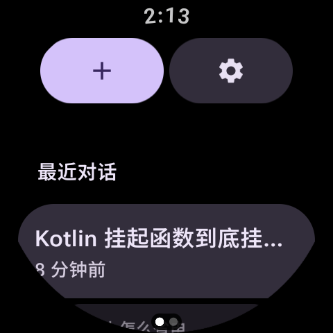
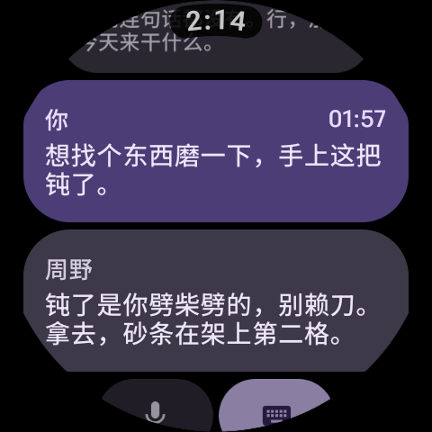
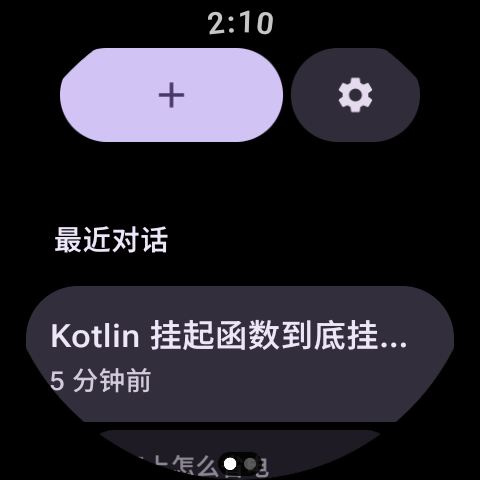
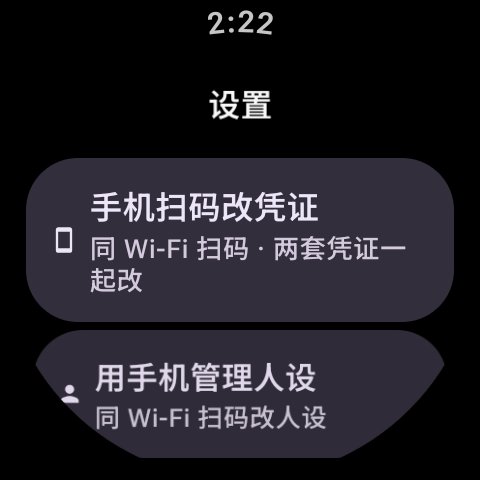
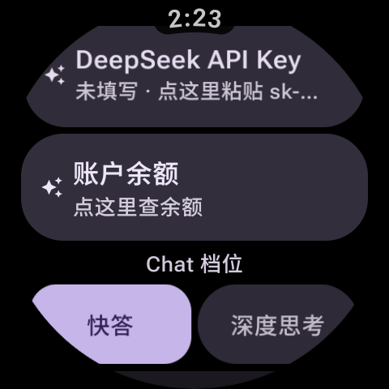
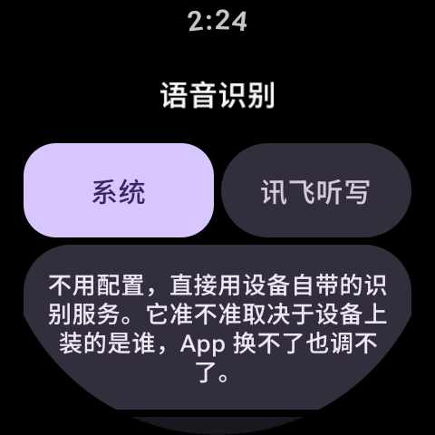
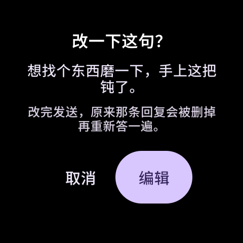
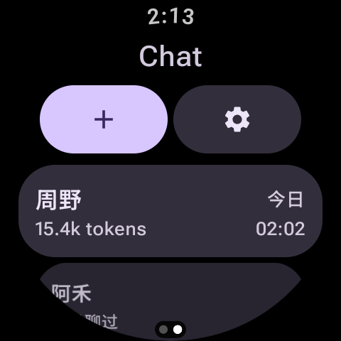
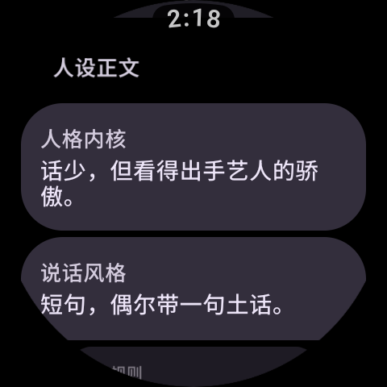
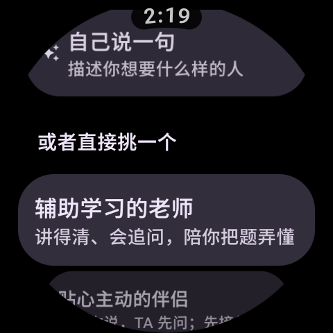

# WhaleChat


> **当前为 2.0 Beta**：功能已经齐了，但接口和交互可能还有调整，档案格式不保证向后兼容到正式版。

在手表上和 DeepSeek 聊天。非官方客户端，跑在 Wear OS 上。

> Unofficial DeepSeek client for Wear OS. Not affiliated with DeepSeek or Google.

> **关于阅读方式**：本文是 Markdown 源文件。请用支持 Markdown 的编辑器打开——GitHub 网页、VS Code、Typora 都可以。  
> 直接双击交给 Word 或记事本，看到的会是原始标记，图片也不会显示，这是 Markdown 格式本身的性质，不是文件损坏。

## 为什么叫 WhaleChat

鲸（whale）是 DeepSeek 的那条鲸，而 `whale` 读起来就是 `wear`——戴在手腕上的那句话。  
名字里**不含任何第三方商标字符串**，上架时不用再为 "Wear" / "DeepSeek" 这两个词解释。

> 包名 `com.naoh.whalechat`。**纯手表端独立运行**——手机上不需要装任何东西，  
> 扫码改凭证用的是你自己的扫一扫／浏览器。

## 目录

- [功能](#功能)
- [两个模式：Ask 与 Chat](#两个模式ask-与-chat)
- [截图](#截图)
- [环境要求](#环境要求)
- [三步用起来](#三步用起来)
- [语音识别](#语音识别)
- [手机上改凭证和人设（扫码）](#手机上改凭证和人设扫码)
- [Token 用量](#token-用量)
- [构建](#构建)
- [代码结构](#代码结构)
- [隐私与安全](#隐私与安全)
- [已知限制](#已知限制)
- [命名与商标](#命名与商标)
- [参与](#参与)

## 功能

- **两个模式：Ask 问答 + Chat 角色聊天** —— Chat 是 2.0 新增：跟虚拟人设聊天，  
  每个角色有自己的性格和说话方式（详见[「两个模式」](#两个模式ask-与-chat)）
- **手表上直接问答**：走 DeepSeek 官方 API，流式输出，边生成边显示
- **两档回答**：「快答」直接作答；「深度思考」先推理再回答，思考过程可以展开看
- **手机扫码改凭证 / 改角色**：手表起一个局域网页面（最长活十分钟），手机扫码就能**看和改**  
  这块表上存着的全部凭证（DeepSeek Key、讯飞三串），以及角色的人设六块，  
  不用在圆屏输入法上敲 35 位 `sk-…`
- **语音输入**：两档可选 —— 设备自带识别，或讯飞语音听写（**边说边出字**）
- **凭证总入口是设置第一项**：「手机扫码改凭证」管的是**两套**凭证 —— 对话用的  
  DeepSeek Key，以及语音识别的讯飞凭证 —— 所以它不隶属下面任何一组，  
  就摆在全页最前面。再往下按「模型」（API Key、回答模式）和「语音识别」（识别引擎）分组，  
  卡片标题直接写明「DeepSeek API Key」，不再笼统叫「API Key」
- **设置页按你从哪一页进来分叉**（同一页，不是两页）：
  - **回答档位一次只给一组** —— 从「Ask」进设置调的是 Ask 那一档，从「Chat」进调的是 Chat 那一档。  
    两档**各存一处**、改一个不动另一个，所以只摆一组；不然并排两组会让人以为改一个两边都变
  - **「系统提示词」只在 Ask 那条路上出现** —— 角色会话的提示词是**人设六块 + 一段硬编码的输出规矩**，  
    每次发送时现拼，跟全局那套提示词**完全无关**。摆出来等于骗用户去改一个不起作用的东西
  - **「清空所有对话」只在 Ask 那条路上出现** —— 它清的是一次性提问的那些会话。  
    Chat 那边是**人**：删角色只能一个一个删，**没有**「一次清空所有联系人」这种按钮
- **会话管理**：本地保存、自动起标题、相对时间、长按删除；长按**最新那条提问**可以改了重发  
  （更早的不给改 —— 改了会把它后面已经发生的整段对话作废）
- **Token 用量**：记账一直在跑，但**默认只在通讯录角色卡上显示**；  
  对话页底部那行「已用 xx tokens · 命中 yy%」默认收起，见[「Token 用量」](#token-用量)
- **Material You**：原生 Wear M3 组件 + 莫奈取色（系统动态色板）
- **Material 3 组合容器**：首页和对话页那一排按钮用的是官方的 `ButtonGroup` ——  
  **按住哪一颗，哪一颗展开、旁边那颗同步让位，整排宽度纹丝不动**，松手弹回。  
  收窄到极限的那颗正好收成一个圆。这不是自己写出来的动画，是组件自带的行为。
- **形状跟着状态变**：「快答 / 深度思考」「系统 / 讯飞听写」这类选一档的开关用  
  `variantAnimatedShapes`：没选中的是胶囊，**选中的那档变成圆角矩形**，一眼看出选的是谁。
- **数据不出手表**：API Key 与聊天记录都只存在手表本机

## 两个模式：Ask 与 Chat

WhaleChat 有两套**完全独立**的聊天方式，首页左右两页各占一个。**Chat 模式是 2.0 最大的更新** ——  
1.0 只有一个「问一句答一句」的 Ask，2.0 把它变成了「问 DeepSeek」和「跟一个真人聊」两件事。

### Ask —— 一次性问答

第一页，也是 1.0 就有的形态。问一句、拿一个答案、走人：

- 走设置里的「系统提示词」，你可以自己定义它该怎么答；
- 会话存在首页列表里，长按删除、自动起标题、相对时间排序；
- 只针对 DeepSeek 本体的快问快答，短而准。

### Chat —— 虚拟人设 / 角色扮演（2.0 新增）

第二页，往左滑进去。这里不是「换个提问方式」，是**换一个说话的对象**：通讯录里每个角色是一张卡，  
点进去你就跟「那个人」聊天。

**跟 Ask 本质不同的地方**：

- **提示词不是全局那套**。角色会话的提示词 = **人设六块 + 一段运行时硬编码的输出规矩**，  
  每次发送时现拼。你在设置里改「系统提示词」对 Chat 完全无效，两套 prompt 分家、互不覆盖。
- **对话有「人」**。每个角色有自己的名字、性格、说话方式，聊起来的语气和边界都不一样。  
  删角色只能一张卡一张卡地删，没有 Ask 那种「一次清空所有对话」。

**造角色三条路**：

1. **让模型现编** —— 写一句描述（「一个嘴硬的剑修理匠」），模型当场生成完整人设；
2. **从预设挑一个改** —— 内置几套现成人设，选一个再按自己口味调；
3. **手机扫码逐块填** —— 在手机网页表单上把六块人设一格一格写好，保存回手表。  
   人设是长文字，在手机上写比在表上敲现实得多。

**人设六块**（每块都有明确的语义标签，模型读到的是结构化设定，不是一坨自述）：

| 块    | 是什么                        |
| ---- | -------------------------- |
| 人格内核 | 性格、价值观、动机、遇到事情怎么反应         |
| 说话风格 | 语气、用词、口头禅、句子长短             |
| 行为规则 | 能做什么、不能做什么、边界在哪            |
| 场景   | 此刻在哪、你们什么关系、为什么聊起来         |
| 示例对话 | 2–4 轮「你：… / TA：…」，性价比最高的一块 |
| 开场白  | 进会话那一刻 TA 说的第一句话           |

前五块拼进提示词；开场白不进去，它作为第一条消息上架。**人设详情页把六块逐块摊开，  
所见即所发** —— 界面上看到哪块，每次发送就带上哪块。

**几个保底设计，让角色聊天不掉链子**：

- **输出规矩硬编码**：角色会话运行时追加一段优先于任何人设的规矩 ——  
  每次只说一到三句、不列点不铺陈、不说自己是 AI/程序、不拿「好的我来帮你」凑数。  
  模型默认爱写长、爱出戏，这段把它拽回来。
- **开场白零延迟**：开场白是创建时存好的固定值，进会话当场写进第一条消息，  
  不等联网、不会失败。
- **没聊过的角色不消失**：角色存亡只由通讯录决定，「点＋又什么都没说就退出 → 会话不留痕」  
  那条规则只对 Ask 生效，联系人不会因为没聊过就掉出列表。

两个模式的对比速览：

|      | Ask（第一页）       | Chat（第二页）             |
| ---- | -------------- | --------------------- |
| 干什么  | 问 DeepSeek 要答案 | 跟一个角色聊天               |
| 提示词  | 设置里的「系统提示词」    | 人设六块 + 硬编码的输出规矩，发送时现拼 |
| 回答档位 | 自己那一档，设置里单独调   | 自己那一档，从通讯录进设置单独调      |
| 会话   | 首页列表，长按删       | 点进角色开聊；删角色在通讯录长按      |

## 截图

| 首页 | 问答 |
| -- | -- |
|  |  |

| 按住按钮会变形（组合容器） | 设置：凭证入口就在第一项 |
| ------------- | ------------ |
|  |  |

| 设置：模型组（形状表示选中） | 语音识别 |
| -------------- | ---- |
|  |  |

| 扫码改凭证 | 修改对话 |
| ----- | ---- |
|  |  |

> 「按住按钮会变形」是按住「＋」不放时截的；设置页两张能看到「手机扫码改凭证」是整页第一项，  
> 选中的「快答」是圆角矩形、没选中的是胶囊 —— 形状本身在说明状态。

### 2.0 Beta 新增界面

| 通讯录（Chat 联系人） | 人设详情 | 造角色 |
| -- | -- | -- |
|  |  |  |

> 这三张是 2.0 才有的画面：通讯录是 Chat 那一页的联系人列表（副标题是相对时间与累计用量），  
> 人设详情把六块人设逐块摊开，造角色页可以用一句话让模型现编、也可以直接从预设挑一个。

## 环境要求

- Wear OS 3.0 及以上（`minSdk 30`，`targetSdk 35`）
- 一块能连 Wi-Fi 的手表（扫码改凭证要用）
- 自备 DeepSeek API Key：<https://platform.deepseek.com>

## 三步用起来

1. **装包**：`adb install WhaleChat-2.0-beta-release.apk`（或你自己 `assembleRelease` 出来的那个包），  
   也可以用 Wear OS 工具箱侧载。手机上不用装任何东西。
2. **填 Key**：设置 → 手机扫码改凭证 → 手机扫表上的码 → 填 DeepSeek Key → 保存到手表。  
   （在圆屏输入法上敲 35 位 `sk-…` 是能做，但不建议折磨自己。）
3. **开聊**：首页按「＋」，说话或者打字；往左滑进通讯录，造一个角色聊天。

## 语音识别

安卓那套语音 API 只负责把音频交给**设备上装的那个识别服务**，  
至于它跑在本地还是联网，由厂商决定，App 没有任何开关能指定。  
设备上装的服务连不上时，表现就是「点了麦克风报错」「提示没有可用的识别」  
或者「经常听不准」—— 这是服务本身的问题，从应用侧调不了。

想稳定拿到联网识别，唯一的路是自己录、自己传。在 **设置 → 语音识别 → 识别引擎** 里二选一：

| 档位   | 行为                              |
| ---- | ------------------------------- |
| 系统   | 用设备自带的识别服务，不需要配置                |
| 讯飞听写 | 讯飞语音听写（流式），边录边发，**边说边出字**，不用等录完 |

## 语音识别的两个入口

对话页底下两个按钮是**两种不同的用法**，不是一个功能的两种长相：

| 入口     | 行为                                           |
| ------ | -------------------------------------------- |
| 左边的麦克风 | **说完就发**。按一下开始、再按一下结束，识别出字直接作为消息发出去，不跳页、不弹键盘 |
| 右边的键盘  | 进文字输入页。**那一页的麦克风**说完出字先填进输入框，你改完再按发送         |

分开是有原因的：识别错字是常态（「骁龙8gen3」会被听成「8阵3」），而对话页没有输入框，  
把识别结果塞进另一页、键盘还整屏弹起来，动作和预期完全是两回事。所以  
**想快就按麦克风，想改就走键盘**。

### 讯飞听写

走的是**语音听写（流式版）**：音频按 1280 字节切片边录边发，服务端把识别结果一片片推回来，  
所以说完话立刻就有字，等待感最小。

在讯飞控制台建一个 **WebAPI** 应用就能用，默认每日 500 次免费，个人用足够。  
要填三样，都在「我的应用」里，**缺一样都调不通**：

- AppID（8 位十六进制）
- APIKey（32 位十六进制）
- APISecret（32 位十六进制）

讯飞控制台里另有两档「语音听写大模型」，本项目**都不支持**，原因都是拿真凭证实测出来的：

- **大模型（中英）V1.0**（`iat.xf-yun.com/v1`）：官方只对历史已购用户开放新开通。  
  用新账号的凭证握手，服务端直接回 `10404 no category route found` 并断连 —— 连门都进不去。
- **大模型 V2**：查不到可用的官方端点（曾经照着一份文档猜过一版，  
  连主机名都不解析），已从代码里删掉，不再提供档位开关。

所以要接，就只有「语音听写（流式版）」这一条路。它会**边说边出字**，  
说完立刻有结果，对短句最合适。

> **讯飞的 APISecret 要在手表本地参与签名**，所以装了这个 App，表上就有这把密钥。  
> 自己用没问题，别把这个包发给别人。

> **切到「讯飞听写」之后，你说话的录音会发给讯飞。** 这一点没法回避：  
> DeepSeek 官方 API 只接受文本（`messages[].content` 是字符串，请求体里没有任何音频字段），  
> 音频必须先变成文字它才看得见。不想把录音传出去，就留在「系统」档。

## 手机上改凭证和人设（扫码）

手表屏幕上填这些字符串（DeepSeek 的 `sk-…` 35 位、讯飞那两个 32 位十六进制）  
基本没法完成，所以有一个手机页：

1. **设置 → 手机扫码改凭证**（设置页第一项），手表起一个局域网 HTTP 服务并把它编成二维码（最长活 10 分钟）；
2. 手机（和手表同一个 Wi-Fi）扫码打开网页 —— **表单里预填的，就是这块表上现在存着的值**，  
   DeepSeek Key、识别引擎、讯飞三格，一格不落；
3. 直接在上面改，点「保存到手表」。

从通讯录（Chat）进设置的话，会多一项「用手机管理人设」：手机页上还能改角色的  
人设六块。大段文字在手机上写比在表上敲现实得多 —— 页面放宽到 10 分钟就是为这个。

三条规则，写在这里免得踩坑：

- **整屏覆盖**：提交什么就存什么。所以**清空某一格再保存 = 删掉那一项** ——  
  这也是删掉某一项的唯一办法（留空要是被当成「没填」而保留原值，写进去的 Key 就再也删不掉）。
- **引擎要对得上**：选了「讯飞听写」却三样没填齐，页面会拦下来并告诉你缺哪一项；  
  不用讯飞就把引擎改成别的档。
- 讯飞三项填齐、而引擎那一栏还停在「系统」时，保存会**顺手切到讯飞听写**，  
  并在结果页写明（不写出来就成了暗改）。

## Token 用量

WhaleChat 会记账，但**默认只显示一部分**。当前 Beta 的默认组合是：

| 位置 | 默认 | 内容 |
| ---- | ---- | ---- |
| 通讯录角色卡片 | **显示** | 跟这个角色累计聊掉的 `19.2k tokens`（带复数 s） |
| 对话页底部 | **不显示** | `已用 19.2k tokens · 命中 87%` 那一行 |
| 消息气泡时间 | **显示** | 你自己发出的那条消息右上角的时间 |
| Ask 首页会话列表 | **从不显示** | 那一页问完就走，堆数字只会分心 |

**为什么会记账、却默认不显示？** 用量是**只增不减的历史**，攒在你本机的会话文件里，  
不是临时状态。Beta 期间先把对话页那行小字藏起来，是**少一类会变化、会来回调整的显示** ——  
数据显示得对不对，得跟服务端 `usage` 字段的实际口径逐条对齐才敢摆出来，那是正式版的事。

**想让对话页底部那行显示出来：** 三个开关都在代码里、逻辑都在、随时能打开 ——  
把 `SettingsScreen.SHOW_DISPLAY_SETTINGS_ENTRY` 改回 `true` 重新构建，  
设置里就会出现「显示设置」二级页，三个开关各管一处。**没有删掉的功能，只是入口默认收起了。**

### 那行小字到底在算什么

给打开开关的人看 —— 这几个数都来自每次回复的 `usage` 字段，流式收尾时落盘。

- **总量** = 输入 + 生成，从每次回复累加。
- **缓存命中率** = `prompt_cache_hit_tokens / (hit + miss)`。DeepSeek 对命中上下文缓存的  
  输入**按一折计费**，长对话省钱的大头就在这个比例上。
- **没有数据时命中率整段不显示**：「没统计过」和「命中 0%」是两回事，混起来看着就是个 bug。  
  所以老对话（存的时候还没有这两个字段）读回来是**不显示**，而不是显示 0%。
- **命中率只出现在对话页底部那一行**，不换算成钱、不加单独的开关。

## 构建

```bash
# 调试包
./gradlew assembleDebug

# 发布包（R8 混淆 + 资源压缩）
./gradlew assembleRelease
```

发布包需要签名配置。在**工程根**放一个 `keystore.properties`（已在 `.gitignore` 里）：

```properties
storeFile=keystore/your.jks
storePassword=…
keyAlias=…
keyPassword=…
```

构建产物在 `app/build/outputs/apk/`。

### 可选：出包时预置凭证

手表上敲 Key 很痛苦（讯飞那两个还是 32 位字符串），所以留了个口子：  
在 `keystore.properties` 里补上对应的行（或命令行加 `-PpresetApiKey=…` 这种同名参数），  
App **首次启动**会自动写入设置：

```properties
presetApiKey=sk-…                    # DeepSeek
presetXfyAppId=…                     # 讯飞 AppID
presetXfyApiKey=…                    # 讯飞 APIKey
presetXfyApiSecret=…                 # 讯飞 APISecret
presetAsrEngine=xfyun                # 可选，留空时：给了讯飞凭证就切讯飞
```

任一项留空 = 不预置那一项，行为与「设置页手填」完全一致。

预置按**内容指纹**判断：包里的预置内容和上次写入的一致就什么都不做（所以你自己在  
设置里改过或删掉，不会被下次启动悄悄覆盖）；换一批凭证重新出包装上，才会重写一次。

> ⚠️ 凭证会以**明文**躺在 APK 里，谁拿到包谁就能读出来。带凭证的包**不要外发**。
>
> 要出**可以外发**的包，把这几项在命令行上显式清空即可（`-P` 优先级高于  
> `keystore.properties`，不用改文件）：
>
> ```bash
> ./gradlew assembleRelease \
>   -PpresetApiKey= -PpresetXfyAppId= -PpresetXfyApiKey= -PpresetXfyApiSecret= -PpresetAsrEngine=
> ```
>
> `dist/` 下只出两版：`WhaleChat-<版本>-release.apk`（干净，可外发）  
> 与 `WhaleChat-<版本>-debug.apk`（带预置凭证，**仅供自测**）。
>
> 交付前逐包跑 `python tools/audit_apk.py <apk>` 过一遍：带凭证的包和干净包  
> 文件大小几乎一样，肉眼分不出来，只能靠审计 dex 里的字符串确认。

## 代码结构

```
app/src/main/java/com/naoh/whalechat/
├── MainActivity.kt          单一 Activity，权限与主题入口
├── WhaleChatApplication.kt  应用级初始化
├── BuildSecrets.kt          出包时烤进来的凭证（默认空串）
├── data/
│   ├── SettingsStore.kt     全部设置 + 预置凭证的指纹落盘
│   ├── ConversationStore.kt 会话单文件 JSON
│   ├── PersonaStore.kt      角色单文件 JSON
│   ├── Persona.kt           人设六块、输出规矩
│   ├── PersonaFactory.kt    由一句描述让模型现编人设
│   ├── PersonaPresets.kt    内置预设人设
│   ├── ChatEngine.kt        组装请求、带上文、流式回传、用量累加
│   ├── KeyImportServer.kt   扫码改凭证/人设：局域网 HTTP 服务 + 二维码
│   ├── UsageStore.kt        Token 用量
│   └── Models.kt            消息 / 会话数据类
├── net/
│   ├── DeepSeekClient.kt    SSE 流式对话
│   ├── SpeechException.kt   识别失败时带上「人话提示」的异常
│   └── XfyunIat.kt          讯飞语音听写：WebSocket 签名 + 流式帧
├── voice/
│   ├── AudioRecorder.kt     AudioRecord 直采 16 kHz 单声道
│   └── VoiceInput.kt        两个入口的行为分派
└── ui/
    ├── HomeScreen.kt        首页两页：Ask 会话列表 + Chat 通讯录
    ├── ChatScreen.kt        对话页（Ask 与 Chat 共用）
    ├── PersonaDetailScreen.kt 角色详情：人设六块摊开
    ├── PersonaNewScreen.kt  造角色：一句描述现编
    ├── PersonaPresetScreen.kt 造角色：从预设挑一个改
    ├── PersonaWaitScreen.kt 造角色：手机扫码填表单的等待页
    ├── InputScreen.kt       文字输入页
    ├── SettingsScreen.kt    设置（凭证入口在第一项）
    ├── DisplaySettingsScreen.kt 显示设置
    ├── SpeechSettingsScreen.kt
    ├── ImportKeyScreen.kt   二维码页
    ├── WhaleChatApp.kt      导航图
    ├── Components.kt        ButtonGroup / 形状动画等复用件
    ├── AppIcons.kt          自绘图标
    └── theme/Theme.kt       莫奈取色与 Wear M3 主题
```


```

第三方依赖只有两个：**OkHttp**（SSE 流式读取）和 **ZXing core**（把扫码 URL 编成二维码；  
二维码的绘制是自己手写的，所以不必引 javase 那一大坨）。UI 全是官方 Wear Compose Material 3。  
录音直接用系统 `AudioRecord`，WAV 头是手写的 44 字节，没有引入额外音频库。

`tools/` 下还有两个脚本：`audit_apk.py` 扫 dex 确认包里有没有被烤进去的凭证  
（出包后建议跑一遍，靠文件大小是分不出来的，见构建那节），  
`export_icon.py` 从 VectorDrawable 导出启动图标的高清位图。

## 隐私与安全

完整说明见 [`PRIVACY.md`](PRIVACY.md)，漏洞报告方式见 [`SECURITY.md`](SECURITY.md)。要点：

- 各把 Key（DeepSeek 的、讯飞的）都存在 App 私有的 `SharedPreferences`，  
  聊天记录写在 `filesDir/conversations.json`，都在应用沙箱内，其他 App 读不到。
- 已关闭 `android:allowBackup`，避免 Key 和聊天记录被系统云备份带走。
- 聊天只发往 `https://api.deepseek.com`。语音识别默认走设备自带的本地服务；  
  **只有你主动切到「讯飞听写」之后**，录音才会发给讯飞。没有统计、没有遥测。
- **扫码页是局域网明文 HTTP**，而且那个 URL 不只是写入入口，还是**整份凭证的读入口** ——  
  谁在它活着的那十分钟里打开，就能看到全部 Key。暴露面靠这几条压到很小：  
  64 位随机 token 写在 URL 里、最长只活 10 分钟、改凭证的话收到一次合法提交就立刻关停、只在扫码页存活。  
  页面能留到 10 分钟，是为了让你在手机上填完角色的人设六块 —— 改角色是多次交互，改完一个还要接着改下一个。  
  **别在公共 Wi-Fi 下用它**；页面自己也写了这句提醒。能读回值是有意的：看得见自己存进去的是什么，才知道到底存没存上。

## 已知限制

- 只支持 DeepSeek 官方 API，不接第三方兼容端点。
- 带上文：Ask 取最近 20 条、角色会话放宽到 30 条，字数预算同样约 8000 字 ——  
  很长的对话不会整段回传。
- 会话是单文件 JSON，手表上几十条量级没问题，再多需要换存储。
- 语音识别单次最长 60 秒。「讯飞听写」是流式的，边说边出字，等待感最小。


- 讯飞听写用的签名算法要求在手表本地拿到 APISecret，没法只存服务端。
- 没有 Complication / Tile，也没有手机端伴侣 App。
- 2.0 Beta 的会话 / 角色档案格式不保证向后兼容到正式版（见顶部 Beta 说明）。

## 命名与商标

- **DeepSeek** 是杭州深度求索人工智能基础技术研究有限公司的商标。本项目是**非官方**客户端，  
  只在「说明这个 App 用来访问 DeepSeek 服务」这层含义上使用该名称，不使用官方图标、  
  不代表官方、非商业用途。
- **WhaleChat** 这个名字里不含 "DeepSeek" / "Wear" 字样，鲸的形象只作为项目自身的视觉比喻，  
  不使用 DeepSeek 官方美术资产。
- 本项目与 DeepSeek、Google 均无隶属、授权或赞助关系。

## 参与

- 提问题：[Issues](https://github.com/NaOHaminuosi/WhaleChat/issues) —— 提问前先翻 [`docs/FAQ.md`](docs/FAQ.md)
- 改代码：先看 [`CONTRIBUTING.md`](CONTRIBUTING.md)
- 版本记录：[`CHANGELOG.md`](CHANGELOG.md)

## 许可

[MIT](LICENSE)。
```
