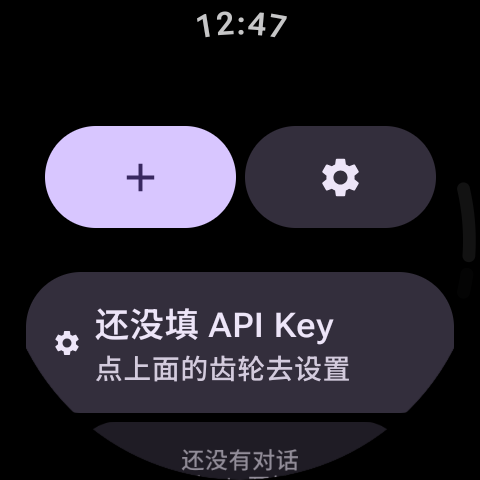
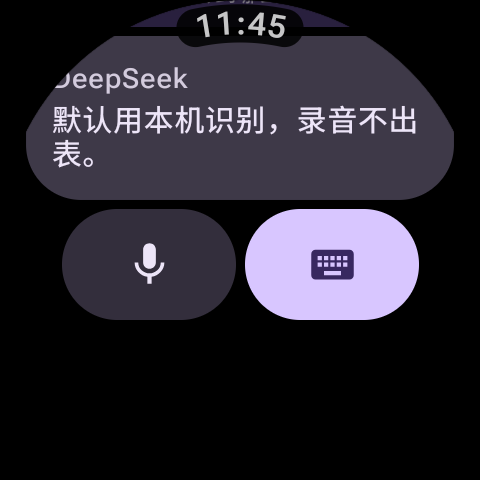
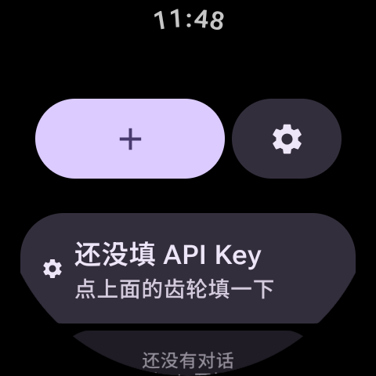
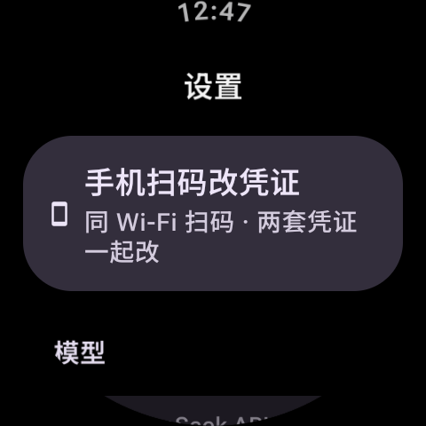
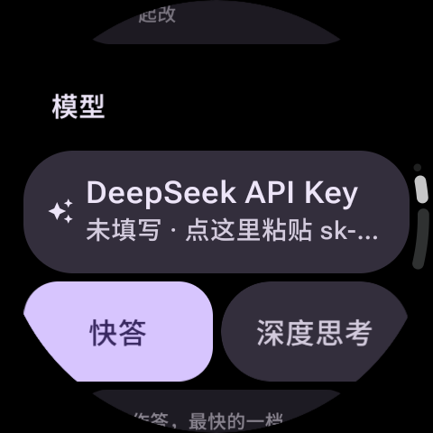
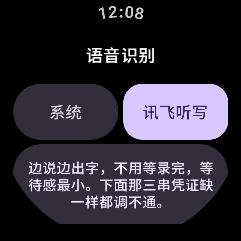
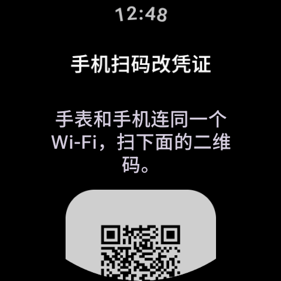

# WhaleChat


在手表上和 DeepSeek 聊天。非官方客户端，跑在 Wear OS 上。

> Unofficial DeepSeek client for Wear OS. Not affiliated with DeepSeek or Google.

## 为什么叫 WhaleChat

鲸（whale）是 DeepSeek 的那条鲸，而 `whale` 读起来就是 `wear`——戴在手腕上的那句话。  
名字里**不含任何第三方商标字符串**，上架时不用再为 "Wear" / "DeepSeek" 这两个词解释。

> 包名 `com.naoh.whalechat`。**纯手表端独立运行**——手机上不需要装任何东西，  
> 扫码改凭证用的是你自己的扫一扫／浏览器。

## 目录

- [功能](#功能)
- [截图](#截图)
- [环境要求](#环境要求)
- [三步用起来](#三步用起来)
- [语音识别](#语音识别)
- [手机上改凭证（扫码）](#手机上改凭证扫码)
- [构建](#构建)
- [代码结构](#代码结构)
- [隐私与安全](#隐私与安全)
- [已知限制](#已知限制)
- [命名与商标](#命名与商标)
- [参与](#参与)

## 功能

- **手表上直接问答**：走 DeepSeek 官方 API，流式输出，边生成边显示
- **两档回答**：「快答」直接作答；「深度思考」先推理再回答，思考过程可以展开看
- **手机扫码改凭证**：设置页第一项。手表起一个局域网页面，手机扫码就能看和改表上存着的
  全部凭证（DeepSeek Key、讯飞三串），不用在圆屏输入法上敲 35 位 `sk-…`
- **语音输入**：设备自带识别，或讯飞语音听写（边说边出字）
- **会话管理**：本地保存、自动起标题、相对时间、长按删除；长按最新那条提问可以改了重发
- **Material You**：原生 Wear M3 组件 + 莫奈取色
- **Material 3 组合容器**：那排按钮用官方 `ButtonGroup`，按住哪颗哪颗展开、旁边同步让位，整排宽度不变
- **形状跟着状态变**：选一档的开关用 `variantAnimatedShapes`，选中的变成圆角矩形，一眼看出选的是谁
- **数据不出手表**：API Key 与聊天记录都只存在手表本机

## 截图

| 首页 | 问答 |
| -- | -- |
|  |  |

| 按住按钮会变形（组合容器） | 设置：凭证入口就在第一项 |
| ------------- | ------------ |
|  |  |

| 设置：模型组（形状表示选中） | 语音识别 |
| -------------- | ---- |
|  |  |

| 扫码改凭证 | 修改对话 |
| ----- | ---- |
|  |  |

> 「按住按钮会变形」是按住「＋」不放时截的；设置页两张能看到「手机扫码改凭证」是整页第一项，
> 选中的「快答」是圆角矩形、没选中的是胶囊 —— 形状本身在说明状态。

## 环境要求

- Wear OS 3.0 及以上（`minSdk 30`，`targetSdk 35`）
- 一块能连 Wi-Fi 的手表（扫码改凭证要用）
- 自备 DeepSeek API Key：<https://platform.deepseek.com>

## 三步用起来

1. **装包**：`adb install WhaleChat-1.0-release.apk`（或你自己 `assembleRelease` 出来的那个包），  
   也可以用 Wear OS 工具箱侧载。手机上不用装任何东西。
2. **填 Key**：设置 → 手机扫码改凭证 → 手机扫表上的码 → 填 DeepSeek Key → 保存到手表。  
   （在圆屏输入法上敲 35 位 `sk-…` 是能做，但不建议折磨自己。）
3. **开聊**：首页按「＋」，说话或者打字。

## 语音识别

设备自带的识别服务跑在本地还是联网由厂商决定，App 控制不了；连不上时表现就是「听不准」「没有可用的识别」。
想稳定拿到联网识别，在 **设置 → 语音识别 → 识别引擎** 里二选一：

| 档位 | 行为 |
| -- | -- |
| 系统 | 用设备自带的识别服务，不需要配置 |
| 讯飞听写 | 讯飞语音听写（流式），边录边发，边说边出字 |

### 两个入口

对话页底下两个按钮是两种用法：

| 入口 | 行为 |
| -- | -- |
| 左边的麦克风 | 说完就发：按一下开始、再按一下结束，识别出字直接作为消息发出去 |
| 右边的键盘 | 进文字输入页，那一页的麦克风说完先填进输入框，改完再发送 |

（识别错字是常态，想快就按麦克风，想改就走键盘。）

### 讯飞听写

在讯飞控制台建一个 WebAPI 应用就能用，默认每日 500 次免费。要填三样，都在「我的应用」里，缺一样都调不通：

- AppID（8 位十六进制）
- APIKey（32 位十六进制）
- APISecret（32 位十六进制）

> 切到「讯飞听写」之后，你说话的录音会发给讯飞——DeepSeek 只接受文本，音频得先转成字。
> 不想传录音就留在「系统」档。另外讯飞的 APISecret 要在手表本地参与签名，所以装了这个 App
> 表上就有这把密钥，自己用没问题，别把这个包发给别人。

## 手机上改凭证（扫码）

手表屏幕上填这些字符串（DeepSeek 的 `sk-…` 35 位、讯飞那两个 32 位十六进制）  
基本没法完成，所以有一个手机页：

1. **设置 → 手机扫码改凭证**（设置页第一项），手表起一个局域网 HTTP 服务并把它编成二维码（最长活两分钟）；
2. 手机（和手表同一个 Wi-Fi）扫码打开网页 —— **表单里预填的，就是这块表上现在存着的值**，  
   DeepSeek Key、识别引擎、讯飞三格，一格不落；
3. 直接在上面改，点「保存到手表」。

三条规则，写在这里免得踩坑：

- **整屏覆盖**：提交什么就存什么。所以**清空某一格再保存 = 删掉那一项** ——  
  这也是删掉某一项的唯一办法（留空要是被当成「没填」而保留原值，写进去的 Key 就再也删不掉）。
- **引擎要对得上**：选了「讯飞听写」却三样没填齐，页面会拦下来并告诉你缺哪一项；  
  不用讯飞就把引擎改成别的档。
- 讯飞三项填齐、而引擎那一栏还停在「系统」时，保存会**顺手切到讯飞听写**，  
  并在结果页写明（不写出来就成了暗改）。

## 构建

```bash
# 调试包
./gradlew assembleDebug

# 发布包（R8 混淆 + 资源压缩）
./gradlew assembleRelease
```

发布包需要签名配置。在**工程根**放一个 `keystore.properties`（已在 `.gitignore` 里）：

```properties
storeFile=keystore/your.jks
storePassword=…
keyAlias=…
keyPassword=…
```

构建产物在 `app/build/outputs/apk/`。

### 可选：出包时预置凭证

手表上敲 Key 很痛苦（讯飞那两个还是 32 位字符串），所以留了个口子：  
在 `keystore.properties` 里补上对应的行（或命令行加 `-PpresetApiKey=…` 这种同名参数），  
App **首次启动、或预置内容变化时**会自动写入设置：

```properties
presetApiKey=sk-…                    # DeepSeek
presetXfyAppId=…                     # 讯飞 AppID
presetXfyApiKey=…                    # 讯飞 APIKey
presetXfyApiSecret=…                 # 讯飞 APISecret
presetAsrEngine=xfyun                # 可选，留空时：给了讯飞凭证就切讯飞
```

任一项留空 = 不预置那一项，行为与「设置页手填」完全一致。

预置按**内容指纹**判断：包里的预置内容和上次写入的一致就什么都不做（所以你自己在  
设置里改过或删掉，不会被下次启动悄悄覆盖）；换一批凭证重新出包装上，才会重写一次。

> ⚠️ 凭证会以**明文**躺在 APK 里，谁拿到包谁就能读出来。带凭证的包**不要外发**。
>
> 要出**可以外发**的包，把这几项在命令行上显式清空即可（`-P` 优先级高于  
> `keystore.properties`，不用改文件）：
>
> ```bash
> ./gradlew assembleRelease \
>   -PpresetApiKey= -PpresetXfyAppId= -PpresetXfyApiKey= -PpresetXfyApiSecret= -PpresetAsrEngine=
> ```
>
> 出包后逐包跑 `python tools/audit_apk.py <apk>` 确认 dex 里没有烤进去的凭证 ——
> 干净版和带凭证版**字节数可能完全相同**，靠文件大小分不出来，只能靠审计。
> 没有 `keystore.properties` 时这个脚本会自己提示「只能做形状检查」——那种模式下它只按
> `sk-` / 32 位十六进制的形状扫，不做精确比对，精度低于有配置文件的情形（误报方向是「错抓」不是「放过」）。

## 代码结构

```
app/src/main/java/com/naoh/whalechat/
├── MainActivity.kt          单一 Activity，权限与主题入口
├── WhaleChatApplication.kt  应用级初始化
├── BuildSecrets.kt          出包时烤进来的凭证（默认空串）
├── data/
│   ├── SettingsStore.kt     全部设置 + 预置凭证的指纹落盘
│   ├── ConversationStore.kt 会话单文件 JSON
│   ├── ChatEngine.kt        组装请求、带上文（最近 20 条）、流式回传
│   ├── KeyImportServer.kt   扫码改凭证：局域网 HTTP 服务 + 二维码
│   └── Models.kt            消息 / 会话数据类
├── net/
│   ├── DeepSeekClient.kt    SSE 流式对话（model = deepseek-flash）
│   ├── SpeechException.kt   识别失败时带上「人话提示」的异常
│   └── XfyunIat.kt          讯飞语音听写：WebSocket 签名 + 流式帧
├── voice/
│   ├── AudioRecorder.kt     AudioRecord 直采 16 kHz 单声道
│   └── VoiceInput.kt        两个入口的行为分派
└── ui/
    ├── HomeScreen.kt        会话列表
    ├── ChatScreen.kt        对话页
    ├── InputScreen.kt       文字输入页
    ├── SettingsScreen.kt    设置（凭证入口在第一项）
    ├── SpeechSettingsScreen.kt
    ├── ImportKeyScreen.kt   二维码页
    ├── WhaleChatApp.kt      导航图：首页 / 对话 / 输入 / 设置 / 扫码
    ├── Components.kt        ButtonGroup / 形状动画等复用件
    ├── AppIcons.kt          自绘图标
    └── theme/Theme.kt       莫奈取色与 Wear M3 主题
```

除 androidx / Kotlin 官方生态之外，第三方依赖只有两个：**OkHttp**（SSE 流式读取）和 **ZXing core**（把扫码 URL 编成二维码；  
二维码的绘制是自己手写的，所以不必引 javase 那一大坨）。UI 全是官方 Wear Compose Material 3。  
录音直接用系统 `AudioRecord`，WAV 头是手写的 44 字节，没有引入额外音频库。

`tools/` 下还有两个脚本：`audit_apk.py` 扫 dex 确认包里有没有被烤进去的凭证  
（出包后建议跑一遍，靠文件大小是分不出来的，见构建那节），  
`export_icon.py` 从 VectorDrawable 导出启动图标的高清位图。

## 隐私与安全

完整说明见 [`PRIVACY.md`](PRIVACY.md)，漏洞报告方式见 [`SECURITY.md`](SECURITY.md)。要点：

- 各把 Key（DeepSeek 的、讯飞的）都存在 App 私有的 `SharedPreferences`，  
  聊天记录写在 `filesDir/conversations.json`，都在应用沙箱内，其他 App 读不到。
- 已关闭 `android:allowBackup`，避免 Key 和聊天记录被系统云备份带走。
- 聊天只发往 `https://api.deepseek.com`。语音识别默认走设备自带的本地服务；  
  **只有你主动切到「讯飞听写」之后**，录音才会发给讯飞。没有统计、没有遥测。
- **扫码页是局域网明文 HTTP**，而且那个 URL 不只是写入入口，还是整份凭证的读入口——谁在它活着的那两分钟里
  打开，就能看到全部 Key。暴露面靠这几条压到很小：64 位随机 token 写在 URL 里、最长只活两分钟、
  收到一次合法提交就立刻关停、只在扫码页存活。别在公共 Wi-Fi 下用它；页面自己也写了这句提醒。
  能读回值是有意的：看得见自己存进去的是什么，才知道到底存没存上。

## 已知限制

- 只支持 DeepSeek 官方 API，不接第三方兼容端点。
- 带上文只取最近 20 条 / 约 8000 字，很长的对话不会整段回传。
- 会话是单文件 JSON，手表上几十条量级没问题，再多需要换存储。
- 语音识别单次最长 60 秒。「讯飞听写」是流式的，边说边出字，等待感最小。
- 讯飞听写用的签名算法要求在手表本地拿到 APISecret，没法只存服务端。
- 没有 Complication / Tile，也没有手机端伴侣 App。

## 命名与商标

- **DeepSeek** 是杭州深度求索人工智能基础技术研究有限公司的商标。本项目是**非官方**客户端，  
  只在「说明这个 App 用来访问 DeepSeek 服务」这层含义上使用该名称，不使用官方图标、  
  不代表官方、非商业用途。
- **WhaleChat** 这个名字里不含 "DeepSeek" / "Wear" 字样，鲸的形象只作为项目自身的视觉比喻，  
  不使用 DeepSeek 官方美术资产。
- 本项目与 DeepSeek、Google 均无隶属、授权或赞助关系。

## 参与

- 提问题：[Issues](https://github.com/NaOHaminuosi/WhaleChat/issues) —— 提问前先翻 [`docs/FAQ.md`](docs/FAQ.md)
- 改代码：先看 [`CONTRIBUTING.md`](CONTRIBUTING.md)
- 版本记录：[`CHANGELOG.md`](CHANGELOG.md)

## 许可

[MIT](LICENSE)。

